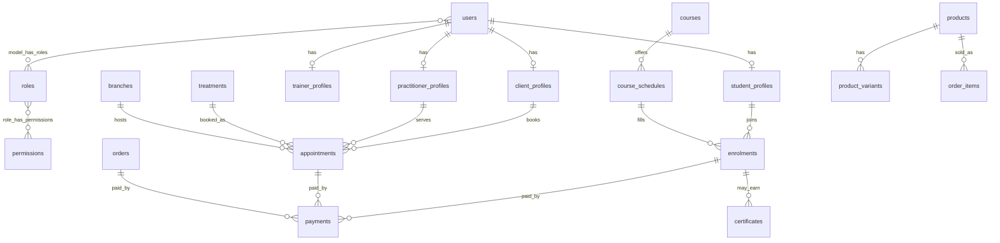

# Database entity plan

Primary database: **MySQL**. Timestamps in UTC. Money as `decimal(12,2)`. Soft deletes where noted.

## Entity relationship overview (Mermaid)

## Core identity

| Table | Purpose |
|-------|---------|
| `users` | Auth identity (email, password, locale, 2FA, lockout) |
| `roles` / `permissions` / pivots | Spatie RBAC |
| `client_profiles` | Client demographics, preferences |
| `student_profiles` | Student academy profile |
| `practitioner_profiles` | Bio, specialities, CEO flag |
| `trainer_profiles` | Trainer bio & qualifications |
| `branches` | Clinic locations, hours, map coords |
| `sessions` / `personal_access_tokens` / `password_reset_tokens` | Framework auth |

## Clinic

| Table | Purpose |
|-------|---------|
| `treatment_categories` | Treatment grouping |
| `treatments` + `treatment_translations` | Catalogue + EN/FR |
| `treatment_practitioner` | Assignment pivot |
| `practitioner_schedules` | Working hours |
| `practitioner_blocked_dates` | Leave / blocks |
| `appointments` | Bookings + status |
| `appointment_status_histories` | Audit trail |
| `consultation_requests` | Online consult intake |
| `consent_records` | Signed consents |

## Academy

| Table | Purpose |
|-------|---------|
| `course_categories` | Levels / types |
| `courses` + `course_translations` | Catalogue |
| `course_modules` | Module outline |
| `course_schedules` | Class dates / capacity |
| `enrolments` + status histories | Student enrolment |
| `instalment_plans` / `student_payments` | Fee plans |
| `attendance_records` | Present/absent/late/excused |
| `course_materials` | Protected downloads |
| `assignments` / `assignment_submissions` | Coursework |
| `assessments` / `assessment_results` | Scoring |
| `certificates` + status histories | Issue / revoke / verify |

## Store

| Table | Purpose |
|-------|---------|
| `product_categories` | Store taxonomy |
| `products` + translations / variants / images | Catalogue |
| `inventory_movements` | Stock ledger |
| `carts` / `cart_items` | Active carts |
| `wishlists` / `wishlist_items` | Saved products |
| `coupons` / `coupon_usages` | Discounts |
| `orders` / `order_items` / `order_addresses` / status histories | Checkout |
| `deliveries` | Shipping / pickup |
| `reviews` | Product & treatment reviews |

## Payments & loyalty

| Table | Purpose |
|-------|---------|
| `payments` / `payment_attempts` / `payment_transactions` | Gateway flow |
| `refunds` | Refund records |
| `loyalty_accounts` / `loyalty_transactions` | Points |
| `referral_codes` / `referrals` / `referral_rewards` | Referrals |

## Messaging, AI, CMS

| Table | Purpose |
|-------|---------|
| `notifications` / `notification_templates` / `notification_logs` | Unified messaging |
| `ai_knowledge_articles` / `ai_conversations` / `ai_messages` | AI assistant |
| `faq_items` / `blog_categories` / `blog_posts` | Content |
| `pages` / `page_sections` | CMS |
| `menus` / `menu_items` | Navigation |
| `galleries` / `media` / `before_after_items` / `testimonials` | Media & social proof |
| `translations` | Dynamic string translations |
| `settings` | Key/value clinic config |
| `audit_logs` | Admin activity |

## Infrastructure

`jobs`, `failed_jobs`, `job_batches`, `cache`, `cache_locks`.

## Indexing notes

- Unique: `users.email`, `treatments.slug`, `courses.slug`, `products.sku`, `certificates.number`, `payments.reference`
- Composite: appointment `(practitioner_id, starts_at)`, schedule availability queries
- Full-text: treatment/course/product names & descriptions where MySQL supports it

## Money & status

- All monetary fields: `decimal(12,2)` + `currency` (default GHS)
- Status columns map to PHP-backed Enums
- Critical writes (booking, checkout, payment verify) use DB transactions
